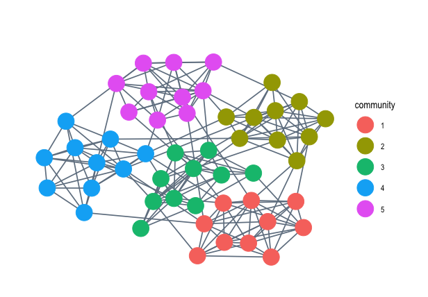

# imageNet

<!-- badges: start -->
<!-- badges: end -->

The goal of the imageNet package is to allow for users to produce clear and 
concise graphs of their networks. Not only do they have the option of producing 
customizable visualizations of standard networks, but users can also
view their networks geographically when they have coordinate information for the nodes. In order to operate this package effectively, it is expected that the user has an elementary understanding of network analysis and knows how to perform a basic evaluation of some format of network (data.frame, igraph, network, etc.) in R.

## Installation

You can imageNet with the following code:

``` r
if(!require(devtools)){
   install.packages("devtools")
}

devtools::install_github("kthomasfranz/imageNet")
```

